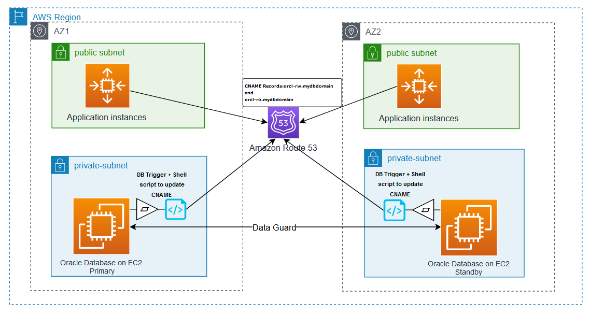
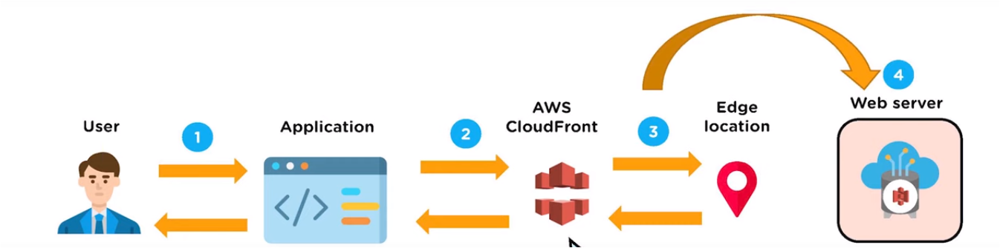

# AWS Route 53 
Amazon Route 53 (Route 53) is a scalable and highly available domain name System (DNS) service. released on Dec 5, 2010. Amazon Route 53 supports full, end-to-end DNS resolution over IPv6.

### Benefits of Route 53 
#### Highly Available and Reliable
AWS Route 53 is built using AWS’s highly available and reliable infrastructure. DNS servers are distributed across many availability zones, which helps in routing end users to your website consistently.
Amazon Route 53 Traffic Flow service helps improve reliability with easy re-route configuration when the system fails.
#### Secure
You can create and grant unique credentials and permissions to each and every user with your AWS account, while you have to mention who has access to which parts of the service.

#### DNS integration
Route 53 Domains integrates seamlessly with the larger Route 53 DNS service, enabling you to manage your DNS records from within the same console or programmatically through the API. This integration makes it easier to connect domains to other AWS services or external resources.

#### Cost-effective
You only pay for what you use, for example, the hosted zones managing your domains, the number of queries that are answered per domain, etc.
Also, optional features like traffic policies and health checks are available at a very low cost.

#### Supported top-level domains
Route 53 Domains supports over 300 Top-Level Domains (TLDs) and is actively working to support more. Having a wide selection of available TLDs allows you to choose the most suitable TLD for your projec(such as .com, .net, or .org).

### Route 53 Interview Questions:
#### Q: What Is Amazon Route 53?
Answer: Amazon Route 53 is a highly scalable and reliable Domain Name System (DNS). Route 53 is used for domain registration, DNS management, traffic routing, and load balancing, including websites, web applications, APIs, and other internet-facing services. It routes the incoming internet traffic to the appropriate resources the based on the domain names entered by users.

#### Q: How does Amazon Route 53 work?
Answer: Amazon Route 53 works by translating human-readable domain names into IP addresses that computers use to communicate with each other. It manages the routing of internet traffic to the appropriate resources based on the domain names entered by users.

An overview of Amazon Route 53 working –

Domain Registration: Route 53 allows you to register new domain names or transfer existing ones to manage them within the service.
DNS Record Configuration: After registering a domain, you need to configure the DNS records to map domain names to specific resources. Route 53 supports various record types such as –
- A Records: Maps a domain to an IPv4 address.
- AAAA Records: Maps a domain to an IPv6 address.
- CNAME Records: Maps a domain to another domain or subdomain.
- MX Records: Specifies the mail server responsible for handling email for the domain.
DNS Resolution: When a user makes a request to access a resource, their device sends a DNS query to their configured DNS resolver (usually provided by their internet service provider). The resolver sends the query to the appropriate Route 53 name server.
Traffic Routing: Route 53 provides advanced traffic routing capabilities. It allows you to define routing policies to distribute incoming traffic based on various factors:
Latency-Based Routing: Routes traffic to the endpoint with the lowest latency for the user.
Geolocation-Based Routing: Routes traffic based on the geographic location of the user.
Weighted Routing: Distributes traffic across multiple endpoints based on specified weights.
Failover Routing: Automatically routes traffic to a standby endpoint in case of a failure.
Health Checks: Route 53 can perform health checks on resources. It periodically sends requests to these resources and verifies their availability.
DNS Query Logging: This feature allows you to analyze traffic patterns, troubleshoot DNS issues, and monitor DNS activity for security and compliance purposes.
#### Q: What are Name servers?
Answer: Name servers, also known as domain name servers or DNS servers, are a fundamental part of the Domain Name System (DNS) infrastructure. They are responsible for translating human-readable domain names (www.example.com) into their corresponding IP addresses that computers use to communicate with each other over the internet.

#### Q: What is a DNS name or alias?
Answer: A DNS name or alias, also known as a CNAME (Canonical Name) record, is a type of DNS record used to create an alternative name or alias for an existing domain or subdomain. It allows you to associate one domain name with another domain name, providing a level of indirection in DNS resolution.

#### Q: What’s the difference between a public hosted zone and a private hosted zone in Amazon Route 53?
Answer: 

Visibility: Public hosted zones are visible to the entire internet, while private hosted zones are limited to specific VPCs or connected networks.

Access Control: Public hosted zones allow access and resolution by any client on the internet, while private hosted zones restrict access to resources within the specified VPC(s) or connected networks.

Resource Accessibility: Public hosted zones enable access to resources from anywhere on the internet, whereas private hosted zones are primarily used for resolving domain names for internal resources within a private network.

#### Q: Is it possible to route traffic based on user location using Amazon Route 53?
Answer: Yes, it is possible to route traffic based on user location using Amazon Route 53. Route 53 provides a routing policy called “Geolocation Routing” that allows you to direct traffic to different endpoints based on the geographic location of the DNS resolver or the end user.

#### Q: Are there any limits to the number of queries we can send through Amazon Route 53?
Answer: Yes, Amazon Route 53 has certain limits in place to ensure fair usage and maintain service performance. The limits imposed by Route 53 can vary depending on the specific features and functions being utilized.

For example, Route 53 Resolver has limit of 10,000 queries per second per IP address on an endpoint. It’s better to review the AWS documentation or contact AWS Support for the most up-to-date information on Route 53 limits.

#### Q: How do users view content stored in S3 buckets when they use Amazon Route 53?
Answer: Amazon Route 53 is primarily a domain name system (DNS) service and does not directly handle content delivery. Amazon Route 53 uses an alias record that maps the domain to the S3 bucket to connect a user-friendly domain name (like www.example.com). So, users can simply type the domain name in their web browser, and Route 53 will direct them to the correct S3 bucket, allowing them to view the content without any hassle.

# CloudFront, CDN(Content Delivery Network):
Amazon Web Services (AWS) CloudFront is a fast content delivery network
(CDN) service that securely delivers data, videos, applications, and APIs to customers globally with low latency and high transfer speeds. It is designed to reduce time, improve reliability and availability, and enhance security for applications and websites.
CloudFront works by caching content and distributing it from Amazon's edge locations, which are located close to end-users to reduce latency. It is a cost-effective solution and is easily integrated with other AWS services.

### Benefits of AWS CloudFront
It will cache your content in edge locations and decrease the workload, thus resulting in high availability of applications.
It is simple to use and ensures productivity enhancement.
It provides high security with the ‘Content Privacy’ feature.
It facilitates GEO targeting service for content delivery to specific end-users.
It uses HTTP or HTTPS protocols for quick delivery of content.
It is less expensive, as it only charges for the data transfer.

### Cloudfront Interview Questions:

#### Q: What is Geo Restriction in CloudFront?
Answer: Geo restriction feature in Amazon CloudFront allows you to restrict access to your content based on the geographical location of the users. With geo restriction, you can choose to allow or deny access to your content from specific countries or regions.

#### Q: How to deliver content faster?
Answer: By Utilizing Content Delivery Network (CDN) like Amazon CloudFront or other similar services. CDNs cache your content in multiple edge locations distributed across the globe. When users request content, it is delivered from the nearest edge location, reducing latency and improving response times.

#### Q: What are the Uses AWS CloudFront?
Answer: AWS CloudFront is a content delivery network (CDN) that accelerates the delivery of web content to end-users globally. It can be used for improving website performance, streaming video content, distributing software and application updates, delivering live and on-demand media streaming, and enhancing security with DDoS protection.

#### Q: How to disable Cache for CloudFront?
Answer: For disable caching – Change the following caching settings –

Minimum TTL: 0 seconds
Maximum TTL: 0 seconds
Default TTL: 0 seconds

#### Q: Can I Use CloudFront for dynamic content?
Answer: Yes, you can use Amazon CloudFront for dynamic content delivery. While CloudFront is commonly known for accelerating the delivery of static content. To support dynamic content delivery, you can configure caching rules based on query strings, cookies, or headers to determine which dynamic content should be cached and for how long.

