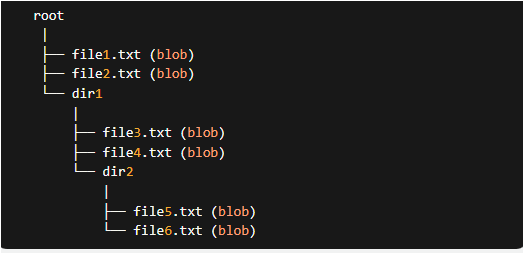

# What is Git Tree?
A tree in Git associates blobs with their actual file path/name and permissions.
Without trees, Git would have no way of identifying which tracked files correspond to the content stored in their blobs.

## Where are Git trees stored?
Trees are stored in Git's repository, also known as the object store. This is located at the path .git/objects/ in your project root directory.

## What is the Git tree format?

tree <size-of-tree-in-bytes>\0
<file-1-mode> <file-1-path>\0<file-1-blob-hash>
<file-2-mode> <file-2-path>\0<file-2-blob-hash>

## When does Git create trees?
- When you use the git add command to tell Git to track a new file or add file modifications to the staging area.

- Next, Git will create a "cache entry" for that blob in the staging area, which in reality is just a plain old nothing-special file called .git/index. 

- When you run git commit, a proper tree (in the format above) is built up in memory from the cache entries in the index file, and referenced as the "root tree" in the new commit object.

## How are Git trees stored?

Once the proper tree is built up in memory, Git calculates the SHA-1 hash of the tree using the OpenSSL SHA library.

Then Git compresses the tree using Zlib, and stores the tree in Git's object store as a loose object. The tree is named using its SHA1 hash, which is also used to organize it into the correct folder in Git's content addressable database.

## Can Git reuse trees across commits?
Yes! Git will never create the same object twice in your object database! So if multiple commits represent snapshots of the exact same set of files, Git will just reuse the existing tree that represents that set.

## What is the difference between a tree and commit?
Trees and commits are different types of Git objects. While a tree links together a set of blobs with their names and permissions, a commit connects a "root tree" with an author, committer, datetime information, commit message, and commit parents

#### There are commands you can use to directly interact with trees:

You can easily find the root tree pointed to by a commit by using the command git rev-parse:

git log --graph

git log --graph -–oneline --all

git rev-parse HEAD^{tree}

git ls-tree

git show

