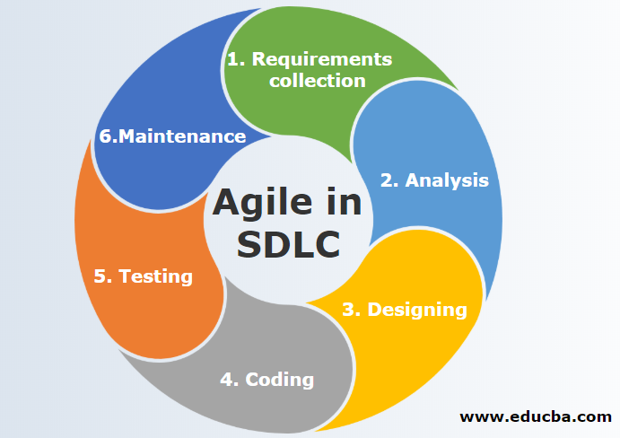
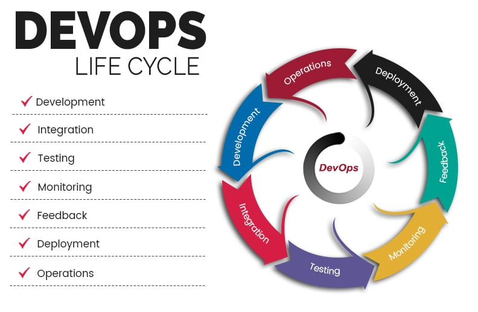
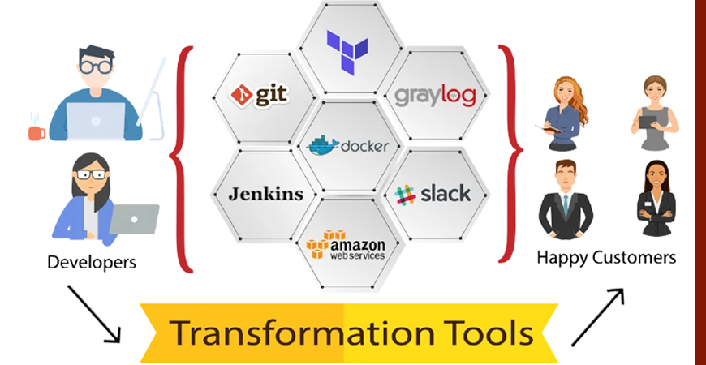
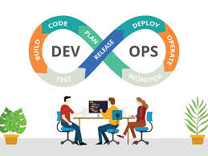
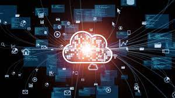
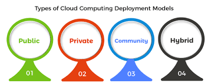
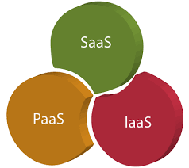
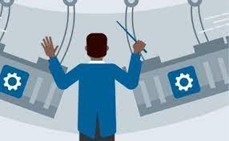
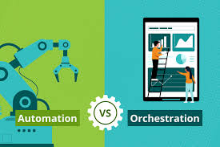

# What’s DevOps and why DevOps came to the world?
## Before start explaining  what’s DevOps we’ll give brief introduction about traditional SDLC that was used before DevOps:
### 1- Waterfall Model: 
a breakdown of project activities into linear sequential phases, meaning they are passed down onto each other, where each phase depends on the deliverables of the previous one and corresponds to a specialization of tasks.

### Drawbacks of the waterfall model: 

•	It’s difficult to make changes to the previous stage.

•	Not recommended for large-sized projects.

•	The developer took a very long time to deploy code.

### 2- Agile Model:
Agile is an approach in software development where each project splits into multiple iterations. As a result, at the end of each iteration, a software product is delivered. Each iteration lasts about one to three weeks.
### Drawbacks of Agile model:
Using the agile method, the code that works for the developer may not work for the operations team.

### 3- DevOps: 
a methodology software development teams use to bring products to market more quickly and efficiently. It's a way of managing the entire software lifecycle from development through release, focusing on collaboration between developers and IT operations.

### So DevOps is :
the combination of cultural philosophies, practices, and tools that increases an organization’s ability to deliver applications and services at high velocity: evolving and improving products at a faster pace than organizations using traditional software development and infrastructure management processes. This speed enables organizations to better serve their customers and compete more effectively in the market.

### The core benefits of DevOps are as follows:
#### Technical benefits
• Continuous software delivery

• Less complex problems to manage

• Early detection and faster correction of defects

#### Business benefits
•	Faster delivery of features

•	Stable operating environments

•	Improved communication and collaboration between the teams

# What Is Cloud Computing?

Cloud computing is the on-demand delivery of IT resources over the Internet with pay-as-you-go pricing. Instead of buying, owning, and maintaining physical data centers and servers, you can access technology services, such as computing power, storage, and databases, on an as-needed basis from a cloud provider like (AWS, Azure, GCP, IBM)

### What is the benefits of Cloud Computing?

1- Faster time to market

2- Scalability and flexibility

3- Cost savings

4- Advanced security

5- Better collaboration

### What is a Cloud Deployment Model?
Cloud Deployment Model functions as a virtual computing environment with a deployment architecture that varies depending on the amount of data you want to store and who has access to the infrastructure.

### Types of Cloud Deployment Models:
- Public Cloud
- Private Cloud
- Hybrid Cloud
- Community Cloud
- Multi-Cloud 

### Cloud Service Models
#### Infrastructure as a Service (IaaS)
It is a computing infrastructure managed over the internet. The main advantage of using IaaS is that it helps users to avoid the cost and complexity of purchasing and managing the physical servers.
- Example: DigitalOcean, Linode, Amazon Web Services (AWS), Microsoft Azure, Google Compute Engine (GCE)

#### Platform as a Service (PaaS)
It is created for the programmer to develop, test, run, and manage the applications.
- Example: AWS Elastic Beanstalk, Windows Azure, Google App Engine, Magento Commerce Cloud, and OpenShift.

#### Software as a Service (SaaS)
It is a software in which the applications are hosted by a cloud service provider. Users can access these applications with the help of internet connection and web browser.

- Example: BigCommerce, Google Apps, Salesforce, Dropbox, Cisco WebEx, Slack, and GoToMeeting.

# What is Automation? 
Automation is the creation and application of technologies to produce and deliver goods and services with minimal human intervention. The implementation of automation technologies, techniques and processes improve the efficiency, reliability, and/or speed of many tasks that were previously performed by humans.

### Types of automation
#### 1-	Basic automation:
Basic or task automation takes simple, repetitive tasks and automates them. This level of automation is about digitizing work by using automation to streamline and centralize routine tasks, and free up people’s time to do higher value, more meaningful work.

#### 2-	Process automation:
Process automation takes more complex and repeatable, multi-step processes by integrating with multiple systems and automates them. This level of automation manages business and IT processes for uniformity and transparency.  It can also deliver new insights into business and IT challenges and suggest solutions using rules-based decisioning.

#### 3-	Intelligent automation:
The most advanced level of automation is intelligent automation. It combines automation with artificial intelligence (AI) and machine learning (ML) capabilities. This means that machines that automations can continuously “learn” and make enable better decision making and actions based on data from past situations they have encountered and analyzed.

# What is Orchestration?
Orchestration is the automated configuration, management, and coordination of computer systems, applications, and services. Orchestration helps IT to more easily manage complex tasks and workflows. IT teams must manage many servers and applications, but doing so manually isn’t a scalable strategy. The more complex an IT system, The need to combine multiple automated tasks and their configurations across groups of systems or machines increases. That’s where orchestration can help.

# Automation VS Orchestration:
- Automation and orchestration are different, but related concepts. Automation helps make your business more efficient by reducing or replacing human interaction with IT systems and instead using software to perform tasks to reduce cost, complexity, and errors. In general, automation refers to automating a single task. This is different from orchestration, which is how you can automate a process or workflow that involves many steps across multiple disparate systems. When you start by building automation into your processes, you can then orchestrate them to run automatically. 
- Automation is programming a task to be executed without the need for human intervention. Orchestration is the configuration of multiple tasks (some may be automated) into one complete end-to-end process or job. Orchestration software also needs to react to events or activities throughout the process and make decisions based on outputs from one automated task to determine and coordinate the next tasks.

## Screenshots

