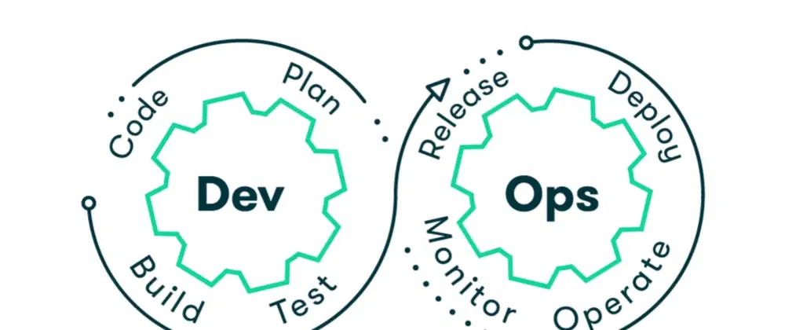

## What is DevOps?

DevOps is a software development methodology that combines software development (Dev) and information technology operations (Ops) to improve collaboration and communication between development teams, IT operations teams, and other stakeholders. DevOps aims to automate the entire software delivery process, from code development to testing, deployment, and infrastructure management, with the goal of making the delivery process faster, more efficient, and more reliable. By breaking down traditional silos between development and operations teams, DevOps enables organizations to deliver high-quality software applications at a faster pace while reducing costs and minimizing risks.
