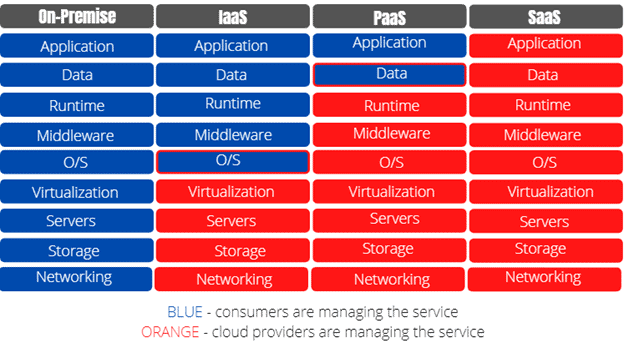

## What is DevOps?

DevOps is a software development methodology that combines software development (Dev) and information technology operations (Ops) to improve collaboration and communication between development teams, IT operations teams, and other stakeholders. DevOps aims to automate the entire software delivery process, from code development to testing, deployment, and infrastructure management, with the goal of making the delivery process faster, more efficient, and more reliable. By breaking down traditional silos between development and operations teams, DevOps enables organizations to deliver high-quality software applications at a faster pace while reducing costs and minimizing risks.
## What is cloud computing?
Cloud computing is a method of delivering on-demand computing resources, such as servers, storage, applications, and services, over the internet. In cloud computing, rather than owning and maintaining physical computing infrastructure, users can access virtualized resources hosted in data centers owned and managed by cloud service providers.

Cloud computing offers several benefits over traditional on-premises computing, including:-

* Scalability: Cloud resources can easily scale up or down to meet changing demands without requiring additional hardware or software installation.

* Flexibility: Users can access cloud resources from anywhere with an internet connection, making it possible to work from any device, location, or time zone.

* Cost efficiency: Cloud computing eliminates the need to purchase and maintain expensive hardware and software, reducing IT overhead costs.

* Reliability: Cloud providers typically provide robust security, backup, and disaster recovery solutions to ensure high availability and data integrity.

Cloud computing services are typically offered through three different models: Infrastructure as a Service (IaaS), Platform as a Service (PaaS), and Software as a Service (SaaS):-

* Infrastructure as a Service (IaaS): In this model, the cloud provider offers virtualized computing infrastructure resources, such as servers, storage, and networking. Users can create, configure, and manage their own virtual machines, operating systems, and applications on this infrastructure, but they are responsible for managing their own data and applications.

* Platform as a Service (PaaS): In this model, the cloud provider offers a complete platform for developing, running, and managing applications without the need to build and maintain the underlying infrastructure. Users can simply deploy their applications to the platform, and the provider takes care of scaling, security, and other infrastructure-related tasks.

* Software as a Service (SaaS): In this model, the cloud provider offers fully hosted and managed software applications that users can access over the internet. Users typically pay a subscription fee based on usage, and the provider is responsible for maintaining and updating the application infrastructure and data.

Each of these cloud computing models provides different levels of control and flexibility, and may be better suited for different use cases and business needs. For example, IaaS might be ideal for organizations that need more control over their infrastructure and want to run complex workloads, while SaaS might be a better fit for organizations that want to quickly adopt and use specific applications without investing in extensive hardware or software resources.

  

## What is the difference between automation, Iac and orchestration? 

Automation, Infrastructure as Code (IaC), and orchestration are all important concepts in modern IT and software development. While they are related, they refer to different aspects of managing IT infrastructure and applications.

* Automation: Automation refers to the process of using tools and scripts to automate repetitive or time-consuming tasks. In IT operations, automation is used to reduce manual effort, improve consistency, and increase reliability. For example, an IT operations team might use automation to automate server configuration, deployment, or monitoring tasks.

* Infrastructure as Code (IaC): IaC is a methodology for managing IT infrastructure using code. Rather than manually configuring servers and other infrastructure components, IaC enables teams to define their infrastructure as code and use automation tools to provision and manage it. This approach helps ensure consistency, reduces errors, and enables more rapid and efficient infrastructure changes and deployments.

* Orchestration: Orchestration refers to the process of coordinating and managing complex workflows or processes across multiple systems or applications. In IT operations, orchestration tools are used to automate and streamline workflows, such as application deployment or disaster recovery procedures. Orchestration tools typically provide a graphical interface for defining workflows, as well as APIs or command-line interfaces for integration with other automation tools.

In summary, automation focuses on reducing manual effort through the use of scripts and tools and it requires a trigger forthe script to run; IaC is a mix between Iac and validation as it validate if the task in hand is already done or not. lastly Orchestration in addition to automation and validation it provides other functionallities like creating a newtork for pods so we can say Orchestration refers to managing multiple automated tasks to create a dynamic workflow.
