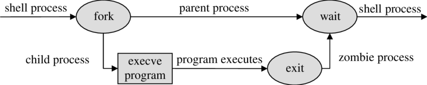
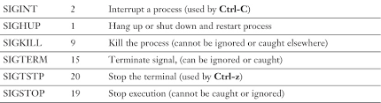

## Introduction


In Linux, a process is an instance of a running program. Understanding how processes work is fundamental to understanding the inner workings of Linux. When a program is executed, the operating system creates one or more processes to execute the instructions in the program.
Each process has its own memory space and set of resources allocated to it by the operating system,
and runs independently of other processes on the system.


## process lifecycle

<p align="center">
  
</p>

In Linux, a process goes through several stages during its life cycle, which are:

* Created: When a user starts a process, it is created and assigned a unique process ID (PID) by the kernel.

* Ready: The process is ready to run but is waiting for the CPU time to be allocated.

* Running: The process is being executed by the CPU and is using system resources such as memory and I/O devices.

*  Blocked: Sometimes, the process may have to wait for some event like user input or I/O operation to complete before it can proceed. In such cases, the process is said to be blocked, and it is temporarily removed from the CPU's execution queue.

    Terminated: Finally, when the process completes its execution, it enters the terminated state and releases all the resources that it was using. At this point, the process is deleted from the system.

However, it's important to note that a process can also be suspended or put in a background state, where it is not running but is still alive and can be resumed later. These states are not technically part of the traditional life cycle, but they are important concepts in process management, which we will explain further in the following topic.

## what is a fork?


<p align="center">
  
</p>
In computing, a "fork" is a system call that creates a new process by duplicating an existing one. The original process becomes the parent of the new process (the "child"), and the child process inherits certain properties of its parent, such as memory and file descriptors. The new child process has its own unique process ID (PID) and can execute different code from its parent.

When a fork occurs, the parent process continues running and executing its instructions, while the child process starts executing its own instructions from where the fork occurred. This allows for parallel processing and efficient use of system resources.

After the child process completes its work, it sends a signal to the parent process indicating its termination and the parent process can then take appropriate actions. If the parent does not wait for the child to terminate, and the child terminates before the parent, the child's state becomes a "zombie" process. A zombie process is essentially a terminated process that still has an entry in the process table, but no longer has a corresponding kernel process. This can cause problems with system resource usage and can result in reduced system performance.

To prevent zombie processes, the parent process should properly handle the termination status of its child processes. This involves using the wait() or waitpid() system calls to retrieve the exit status of the child process and remove its entry from the process table. **but what if the parent for any reason didn't handle it, can we do it manually?** yes to kill a zombie process, you need to find the parent process ID (PPID) of the zombie process and terminate it.

## famous commands:-

*  **top**: The top command in Linux provides a real-time, dynamic view of the processes running on your system.
*  **ps**: The ps command in Linux is used to display information about the processes running on your system, including their process ID (PID), CPU and memory usage, status, parent process ID (PPID), and other details.
*  **kill**: Sends a signal to a single process identified by its process ID (PID).
*  **pkill**: Sends a signal to one or more processes based on their name or other attributes.
*  **killall**: Sends a signal to all processes with a given name.
Note that the kill command requires you to know the PID of the process you want to terminate, while pkill and killall allow you to specify the process(es) to be terminated based on their name or other attributes. Also, be careful when using killall, as it may terminate unintended processes if they share the same name. the following are example to visualize the differrence between those commands:-
```
$ kill 1234
$ pkill myapp
$ killall myapp
```
## different kinds of signals:-

to send a signal to any process you must know two things the process ID we can get it from comands like **ps** and what kind of signal do you want to send, the following table show some famous signals. 

<p align="center">
  
</p>
so if we want to kill a signal pemenantly

```
$ kill -9 PID
```

## EXTRAS comming soon
-  jobs
-  services
-  process
